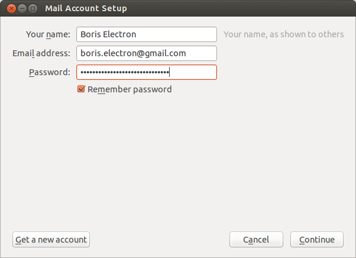
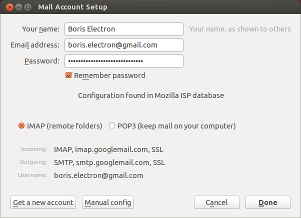
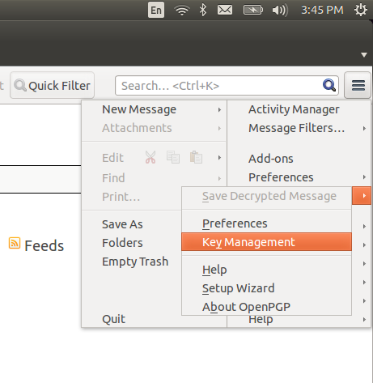
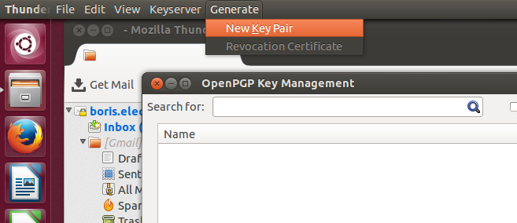
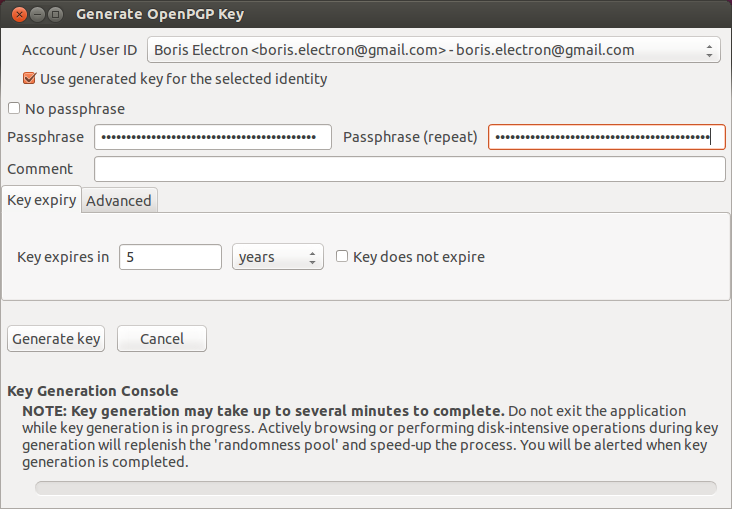
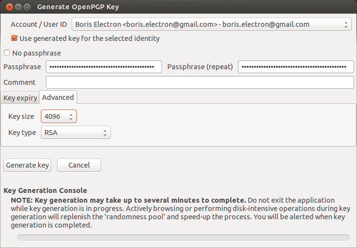
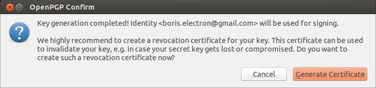
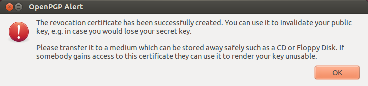
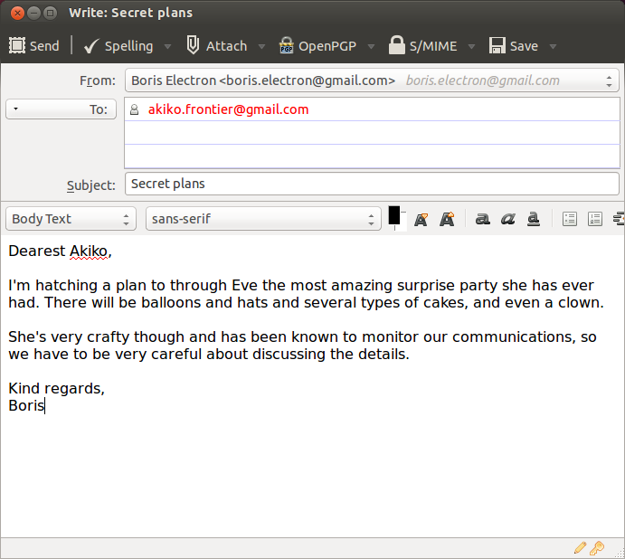

# Using OpenPGP in Linux

Greetings, Linux users!

The first step is to install GnuPG, Thunderbird (an email client), and Enigmail (the GPG add-on for Thunderbird).

If you are using a Debian-based distribution such as Debian, Ubuntu, or Linux Mint, open a terminal and type these commands to make sure you have the right software installed:

    sudo apt-get install gnupg thunderbird enigmail

If you're using using a Red Hat-based distribution such as Red Hat or Fedora Core, open a terminal and run these commands:

    sudo yum install gnupg thunderbird thunderbird-enigmail

## Configuring Thunderbird

Now that you've installed Thunderbird, open it. You you will see the first run wizard. To set up your existing email address, click "Skip this and use my existing email". Then enter your name, email address, and the password to your email account.

If you use popular free email services like Gmail, Thunderbird should be able to automatically detect your email settings when you click Continue. If it doesn't, you may need to manually configure your IMAP and SMTP settings. In this case, Thunderbird auto-detected my email settings:

After you're done configuring Thunderbird to check your email, click Done. Then click on "Inbox" in the top left to load your emails.

## Generate PGP Key

The next step is to generate a PGP key. Click the menu icon in the top-right and choose OpenPGP > Key Management.

When the Key Management window is open, select the Generate menu and choose New Key Pair.

From here you can generate a new PGP keypair. Type your passphrase twice. You can leave the comment blank. You can choose an expiration date as well. When you key expires you can always extend it.

Before clicking the "Generate key" button, switch to the Advanced tab. Change the key size to 4096, which is the most secure PGP key that you can currently make.

If everything is correct, click the "Generate key" button. Enigmail will start generating your key. It shouldn't take more than a couple of minutes to finish.

When it's done, Enigmail will prompt you to create a revocation certificate. This is a file that you can use in the future to revoke your PGP key, in case you ever stop using it or it becomes compromised. Go ahead and create it, and store it somewhre safe.

When it's done you'll see something like this. Yes, I agree that it's weird to see software this decade telling you to copy a file to a floppy disk.

## Configure Enigmail

Click the menu button, hover over Preferences, and choose Account Settings.

Go to the OpenPGP Security tab. Make sure "Enable OpenPGP support (Enigmail) for this identity" is checked. "Use specific OpenPGP key ID" should be selected, and if your key isn't already selected you can click Select Key to select it.

You should also check "Sign non-encrypted message by default", "Sign encrypted messages by default", and "Use PGP/MIME by default", but not "Encrypt messages by default".

It would be ideal to encrypt all the emails you send, but remember that you can only send encrypted email to other people who use PGP, and you need to have their public keys in your keychain as well. Unless everyone you intend to email already uses PGP, it doesn't make sense to always encrypt by default. (You can manually choose to encrypt emails to people who you know use PGP.)

Then click OK to save all of the settings. Congratulations, you now have Thunderbird and Enigmail set up! Here are a couple of quick pointers.

You can click the menu button, hover over OpenPGP, and open Key Management to see the PGP key manager that's build-in to Enigmail. It's very similar to GPG Keychain Access, and it's your choice which you use.

When you're composing a new message, there are two icons in the bottom right corner of the window: a pen (digitally sign email) and a key (encrypt email). If the icons are gold it means they are selected, and if they're silver it means they're not selected. Click on them to toggle signing and encrypting the email you're writing.

You can always sign your emails. Because digitally signing emails requires your secret key, Enigmail will pop up a window asking for your passphrase when you first sign an email. You can only encrypt emails if you have the public key of the person you're emailing. You can try searching for people's public keys from GPG Keychain Access or from Enigmail's Key Management, and you can import keys that people email you as well.

Try sending me an encrypted and signed email next!
