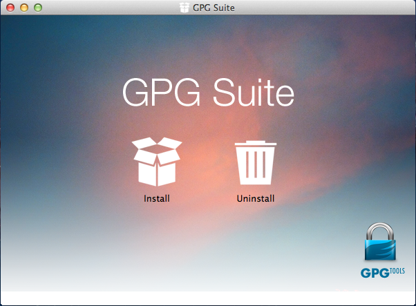
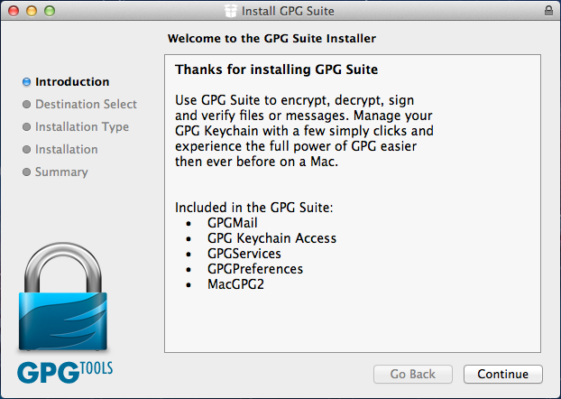
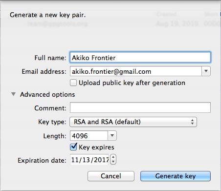
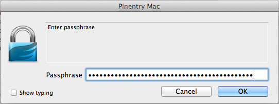
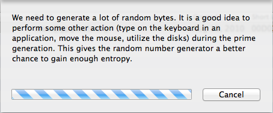
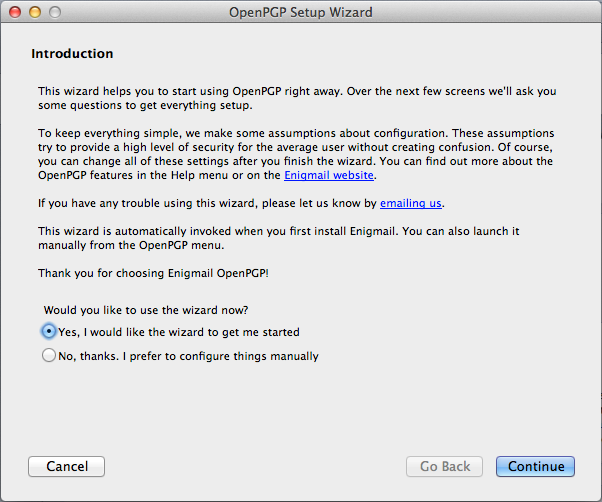
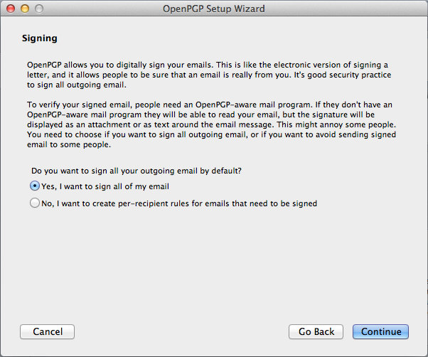
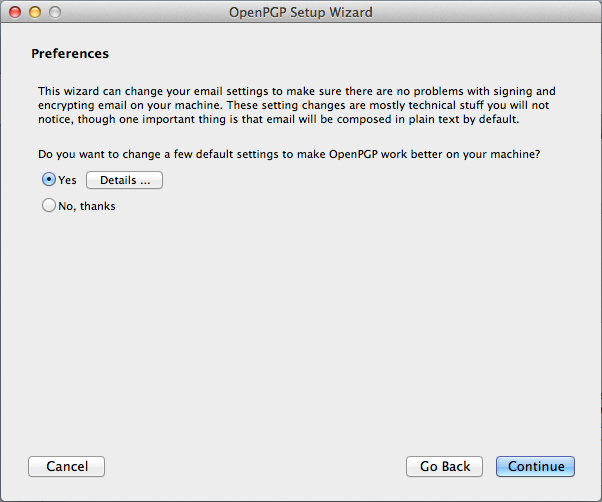
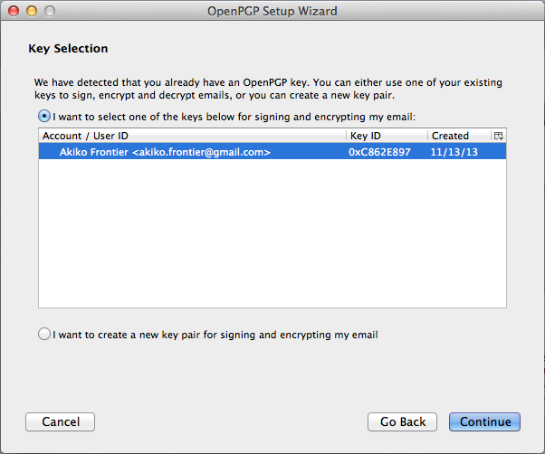
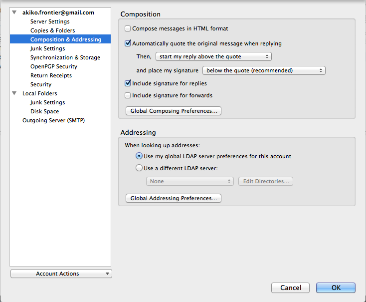

# Using OpenPGP in Mac OS X

Greetings, Mac users! To get started, first you need to install `GPG`, and then you need to install and configure an email client. We recommend that you use Thunderbird because it's free and open source. However if you prefer to use proprietary software, you can also use Apple Mail. Instructions for both are below.

## Installing GnuPG

To install `GPG` in Mac OS X, you need to visit [gpgtools.org](https://gpgtools.org/) and download and install the GPG Suite. When you're done downloading the GPG Suite dmg, mount it.

Then install the suite of tools.

When you install the GPG Suite, you're getting a set of tools. Here's a brief description of what they are:

* **GPGMail** is a plugin for Apple Mail that integrates with GPG.
* **GPG Keychain Access** is a program that helps you manage all of your PGP keys. From here you can generate new keypairs, search key servers for public keys, sign keys, export keys to file, and all sorts of other key management things.
* **GPGServices** and **GPGPreferences** integrate GPG into Mac OS X.
* **MacGPG2** is the Mac OS X port of the base GnuPG software.

When installation is finished, GPG Keychain Access will automatically open, and you will be prompted to generate a new key.

## Generating Your First PGP Key

GPG Keychain Access is prompting you to generate a new keypair. Don't click Generate just yet. Let's look at the options first.

PGP keys contain a name and an email address and some other settings. You're welcome to use a psuedonym. Whatever name you use is what others will see when they encrypt messages that only you can decrypt. It's important to enter the email address that you'll be using with this key to make it simpler for other people to send you encrypted messages. Check the "Upload public key after generation" box if you'd like to make it easier for others to get a copy of your public key so they can send you encrypted messages.

Before generating the key, expand "Advanced options". You can leave the comment blank, and leave the key type "RSA and RSA (default)". But make sure to change the Length field to `4096`. You can also choose an expiration date. When your key expires, you can always extend it's expiration date.

When you're ready, click the "Generate key" button. Before it generates it will prompt you for a passphrase. Type your passphrase and click OK, and re-type it and click OK again.

Then it will start generating your key. It shouldn't take any more than a couple of minutes to finish generating your key.

When you're done generation your key, you'll see your key listed in GPG Keychain Access. You can double-click on your key to see information about it, including it's "fingerprint" -- a unique way to identify your PGP key.

## Installing and Configuring Thunderbird and Enigmail (recommended)

I recommend that you use Thunderbird and Enigmail for email encryption because it's free and open source. If you prefer Apple Mail, you can skip down to the "Configuring Apple Mail" section.

First, download [Thunderbird](https://www.mozilla.org/thunderbird/) from https://www.mozilla.org/thunderbird/, mount the dmg file, and drag Thunderbird into Applications. When you open it for the first time it will ask if you want to set it as your default email client. Go ahead and click "Set as Default".

Then you will see the first run wizard. To set up your existing email address, click "Skip this and use my existing email". Then enter your name, email address, and the password to your email account.

If you use popular free email services like Gmail, Thunderbird should be able to automatically detect your email settings when you click Continue. If it doesn't, you may need to manually configure your IMAP and SMTP settings. In this case, Thunderbird auto-detected my email settings:

After you're done configuring Thunderbird to check your email, click Done. Then click on "Inbox" in the top left to load your emails.

Now that you've installed and configured Thunderbird to work with your email, you need to install [Enigmail](https://www.enigmail.net/home/index.php), the GPG add-on for Thunderbird. In Thunderbird, click the menu icon in the top-right, and choose Add-ons.

Search for "enigmail" in the search box in the top right.

Click the Install button next to the Enigmail extension to download and install Enigmail. When it's done, click Restart Now to restart Thunderbird.

The first time you run Thunderbird with Enigmail enabled it opens the OpenPGP Setup Wizard. It asks if you'd like to use the wizard. Choose Yes, and click Continue.

It asks if you'd like to sign all of your email. Choose Yes and click continue.

It asks if your outgoing mail should be encrypted by default. This would be ideal, but remember that you can only send encrypted email to other people who use PGP, and you need to have their public keys in your keychain as well. Since this probably isn't most people you send emails to, it's best to choose No here and click Continue. (You can manually choose to encrypt emails to people who you know use PGP.)

It asks if you'd like it to change some default settings for you to make OpenPGP work better. Choose Yes and click Continue.

Then it asks you to select a key that you want to use for signing and encrypting. Choose the key that you just created in the last step and click Continue.

Then it shows a summary of what you just did. Click Continue to close it, and click Done on the next step.

There are still a couple of settings that you should change before everything is set up perfectly. Click the menu button, hover over Preferences, and choose Account Settings.

Go to the Composition & Addressing tab. From here, you can optionally check "Compose messages in HTML format". It's up to you if you use HTML or not. HTML email lets you use formatting (like bold and italic), but some people find it annoying as well.

Then choose the OpenPGP Security tab. "Sign non-encrypted message by default" and "Sign encrypted messages by default" should already be checked. Make sure you also check "Use PGP/MIME by default".

Then click OK to save all of the settings. Congratulations, you now have Thunderbird and Enigmail set up! Here are a couple of quick pointers.

You can click the menu button, hover over OpenPGP, and open Key Management to see the PGP key manager that's build-in to Enigmail. It's very similar to GPG Keychain Access, and it's your choice which you use.

When you're composing a new message, there are two icons in the bottom right corner of the window: a pen (digitally sign email) and a key (encrypt email). If the icons are gold it means they are selected, and if they're silver it means they're not selected. Click on them to toggle signing and encrypting the email you're writing.

You can always sign your emails. Because digitally signing emails requires your secret key, Enigmail will pop up a window asking for your passphrase when you first sign an email. You can only encrypt emails if you have the public key of the person you're emailing. You can try searching for people's public keys from GPG Keychain Access or from Enigmail's Key Management, and you can import keys that people email you as well.

Try sending me an encrypted and signed email next!

## Configuring Apple Mail

Apple Mail coming soon...
